= Présentation d'IntelliJ
:sectnums:

== Général

* Installer IntelliJ avec https://www.jetbrains.com/toolbox-app/[JetBrains Toolbox App] :
- permet d'installer n'importe quel outil JetBrains.
- facilite l'installation des mises à jour.

* Liste des shortcuts : `Help` -> `Keyboard Shortcuts PDF`.

== Plugins
:sectnums!:

=== https://plugins.jetbrains.com/plugin/6149-shifter[Shifter]

Alterner entre les différentes cases (kebab-case <--> snake_case <--> camelCase).

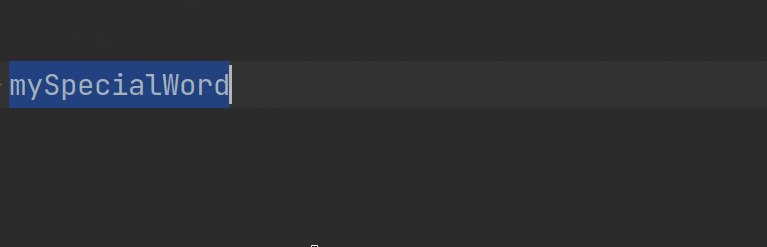

=== https://plugins.jetbrains.com/plugin/7475-tab-shifter[Tab Shifter]

Re-sizer les tabs avec le clavier.

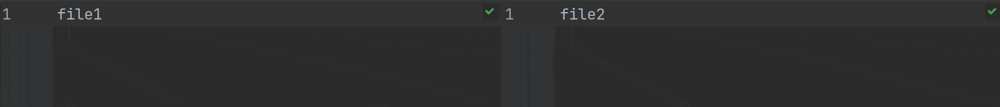

=== https://plugins.jetbrains.com/plugin/7086-acejump[AceJump]

Jumper sur du texte.

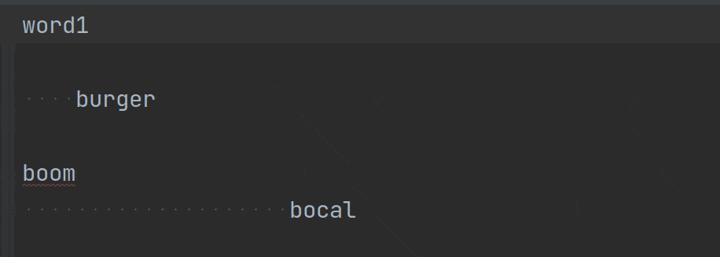

=== https://plugins.jetbrains.com/plugin/7345-presentation-assistant[Presentation Assistant]

Afficher une notification de l'action + shortcut pour chaque action.

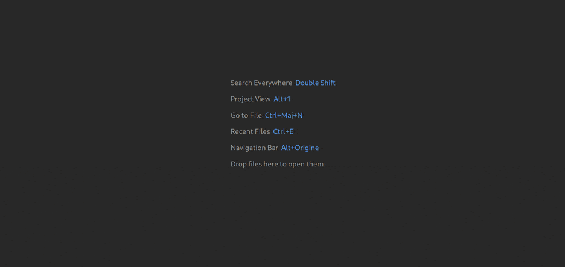

=== https://plugins.jetbrains.com/plugin/9792-key-promoter-x[Key Promoter X]

Afficher une notification quand un shortcut n'est pas utilisé.

image::assets/img/demo-key-promoter-x.png[]

=== https://plugins.jetbrains.com/plugin/7495--ignore[.ignore]

Afficher une bannière quand on édite un fichier présent dans le `.gitignore`.

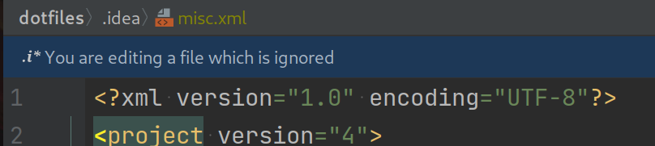

=== https://plugins.jetbrains.com/plugin/8183-gitlink[GitLink]

Ouvrir dans un navigateur l'URL du repository distant du fichier courant, utile pour partager le lien aux autres.

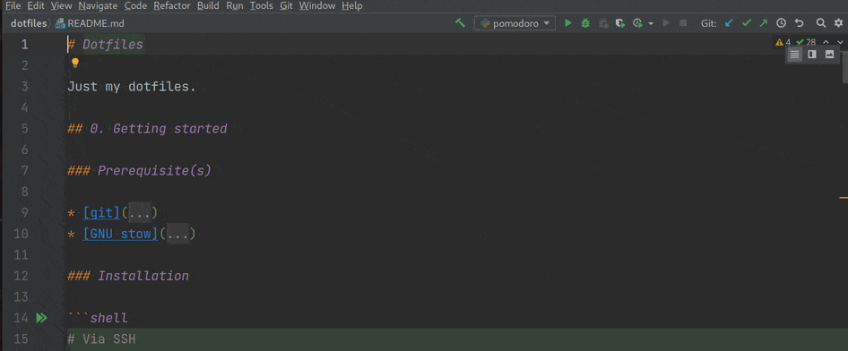

=== https://plugins.jetbrains.com/plugin/10650-json-parser[Json Parser]

Formatter une JSON string.

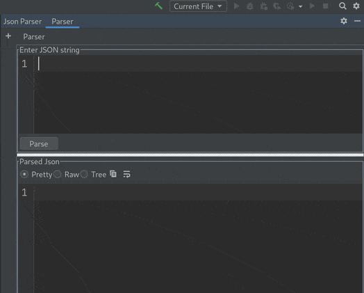

=== https://plugins.jetbrains.com/plugin/164-ideavim[IdeaVim]

Pour avoir le même mode d'édition que Vim : les modes normal/insert/visual, les motion keys, etc.

=== https://plugins.jetbrains.com/plugin/8320-uuid-generator[UUID Generator]

Générer un UUID, utile quand on écrit des tests.

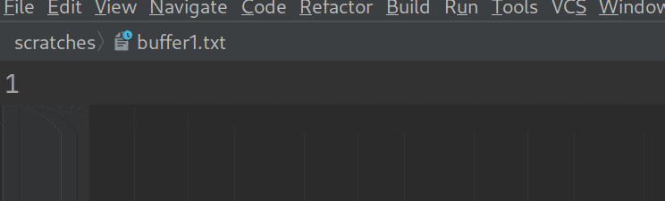

=== https://plugins.jetbrains.com/plugin/12896-rainbow-csv[Rainbow CSV]

Ajouter de la couleur pour les fichiers CSV.

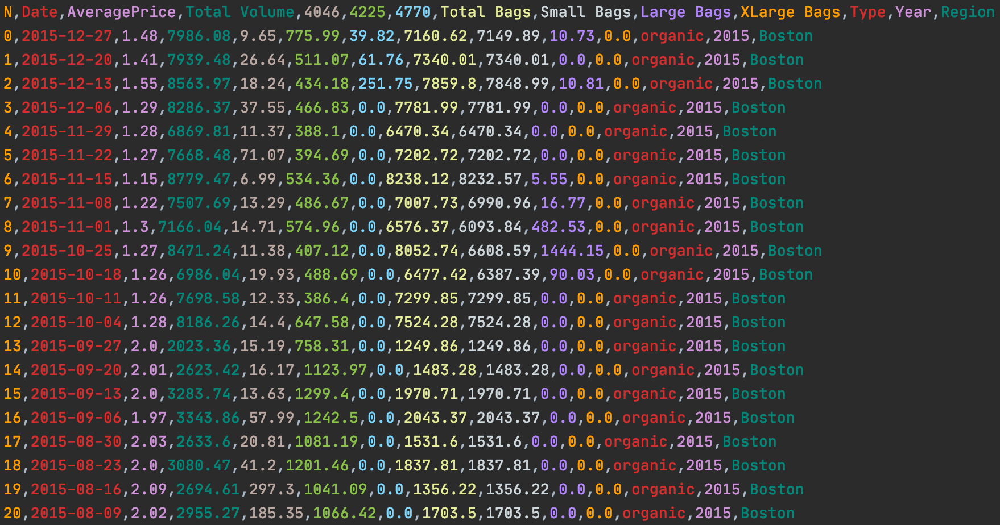

=== https://plugins.jetbrains.com/plugin/7125-grep-console[Grep Console]

Mettre des couleurs custom dans les logs.

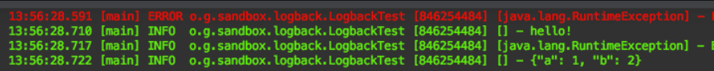

=== https://plugins.jetbrains.com/plugin/10080-rainbow-brackets[Rainbow Brackets]

Accolades, parenthèses, etc. colorisées.

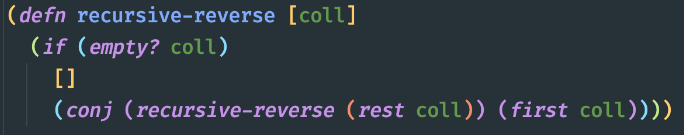

:sectnums:

== Bonus : changer la fréquence de répétition d’une touche

- https://support.apple.com/fr-fr/guide/mac-help/mchl0311bdb4/mac#:~:text=Vous%20pouvez%20d%C3%A9terminer%20combien%20de,faire%20d%C3%A9filer%20vers%20le%20bas[Tuto sur MAC].
- https://help.ubuntu.com/stable/ubuntu-help/keyboard-repeat-keys.html.fr#:~:text=Cliquez%20sur%20Param%C3%A8tres.,r%C3%A9p%C3%A9tition%20en%20basculant%20l'interrupteur[Tuto sur Ubuntu] (ou sinon en CLI avec https://wiki.gentoo.org/wiki/Set_Keyboard_Repeat_Delay_and_Rate[xset]).
