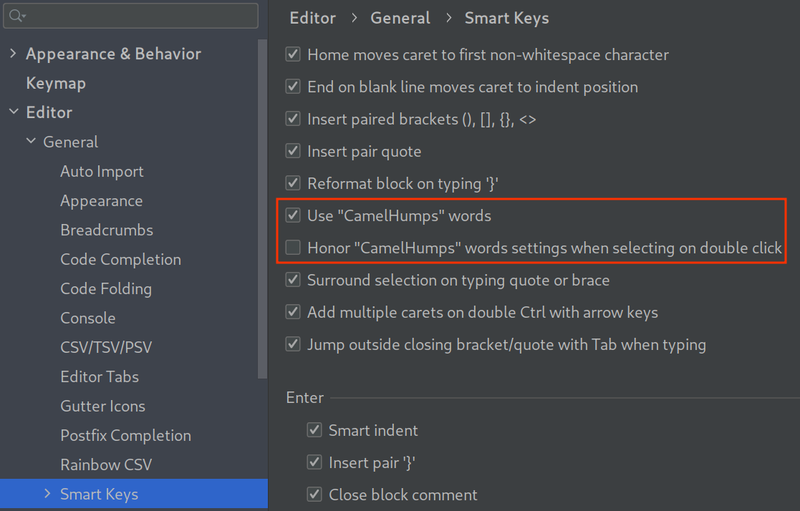
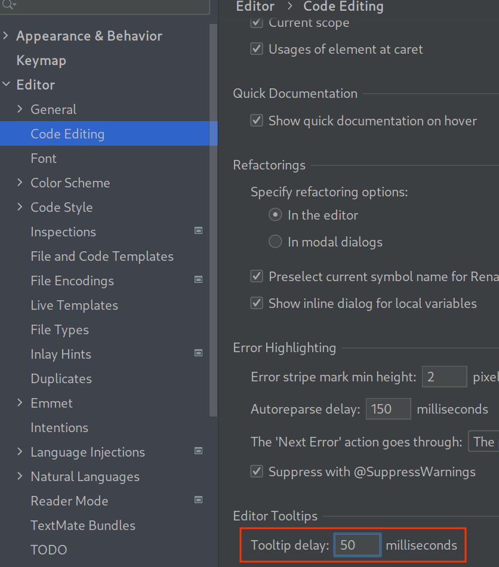

= Tips généraux
:sectnums:
:toc:
:toc-title: Sommaire

== Introduction

Des tips généraux et pas forcément connus sur IntelliJ.

== Comment installer IntelliJ ?

Avec l'outil avec https://www.jetbrains.com/toolbox-app/[JetBrains Toolbox App] qui :

* Permet d'installer n'importe quel outil JetBrains.
* De faciliter l'installation des mises à jour en migrant automatiquement la configuration pour les versions majeures.

== Se déplacer dans le texte avec l'option CamelHumps
:sectnums!:

=== Contexte

Quand on travaille sur du code, est souvent confronté a travaillé avec du texte :

* En camelCase.
* En snake_case.
* En kebab-case.

On veut parfois se déplacer de "CamelHumps" en "CamelHumps" pour éditer plus facilement.

=== Démo - Suppression du mot `en`

[cols="a,a"]
|===
|Sans CamelHumps|Avec CamelHumps

|image::../assets/img/demo-without-camel-humps.gif[]
|image::../assets/img/demo-with-camel-humps.gif[]
|===

Remarques :

* Dans la version avec CamelHumps, on se déplace avec `CTRL + <-` / `CTRL + ->` et on sélectionne avec `SHIFT + CTRL + <-` / `SHIFT + CTRL + ->`.
* Dans la version avec CamelHumps, cela demande d'appuyer sur plus de touches quand on veut naviguer de mot en mot.
* Dans la version avec CamelHumps, il faut s'habituer, c'est un peu déroutant au début.

=== Comment faire ?

:sectnums:

== Diminuer le délai d'apparition des tooltips
:sectnums!:

=== Contexte

IntelliJ met certains bouts de code en surbrillance.
En passant la souris sur le mot, IntelliJ propose des suggestions/remarques/fix dans une tooltip.

Quand on a plusieurs erreurs à regarder, c'est pratique de devoir attendre moins longtemps.

=== Démo

[cols="a,a"]
|===
|Valeur par défaut|Valeur optimisée

|image::../assets/img/demo-default-delay-tooltip.gif[]
|image::../assets/img/demo-low-delay-tooltip.gif[]
|===

=== Comment faire ?

:sectnums:
