= Plugins
:sectnums:
:toc:
:toc-title: Sommaire

== Introduction

Voici une liste de plugins que j'utilise.

== https://plugins.jetbrains.com/plugin/6149-shifter[Shifter]

Alterner entre les différentes cases (kebab-case <--> snake_case <--> camelCase).

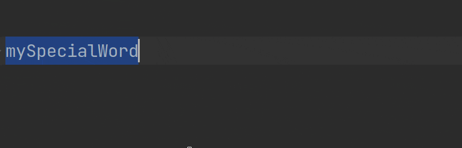

== https://plugins.jetbrains.com/plugin/7475-tab-shifter[Tab Shifter]

Re-sizer les tabs avec le clavier.

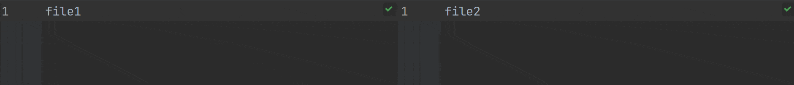

== https://plugins.jetbrains.com/plugin/7086-acejump[AceJump]

Jumper sur du texte.

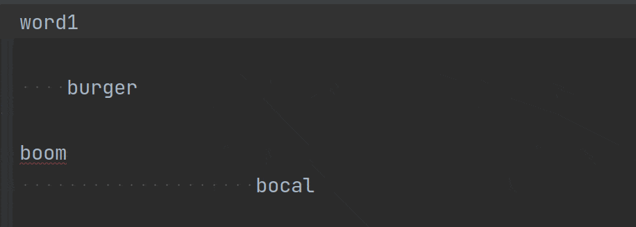

== https://plugins.jetbrains.com/plugin/7345-presentation-assistant[Presentation Assistant]

Afficher une notification de l'action + shortcut pour chaque action.

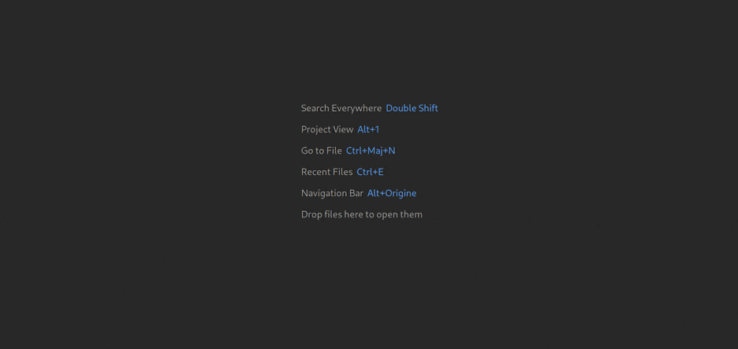

== https://plugins.jetbrains.com/plugin/9792-key-promoter-x[Key Promoter X]

Afficher une notification quand un shortcut n'est pas utilisé.

image::../assets/img/demo-key-promoter-x.png[]

== https://plugins.jetbrains.com/plugin/7495--ignore[.ignore]

Afficher une bannière quand on édite un fichier présent dans le `.gitignore`.

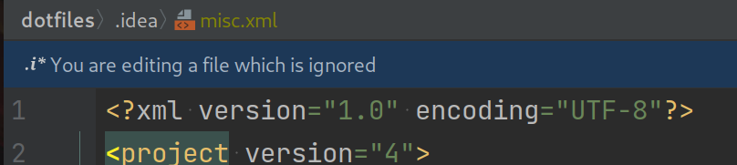

== https://plugins.jetbrains.com/plugin/8183-gitlink[GitLink]

Ouvrir dans un navigateur l'URL du repository distant du fichier courant, utile pour partager le lien aux autres.

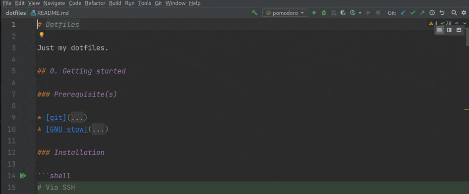

== https://plugins.jetbrains.com/plugin/10650-json-parser[Json Parser]

Formatter une JSON string.

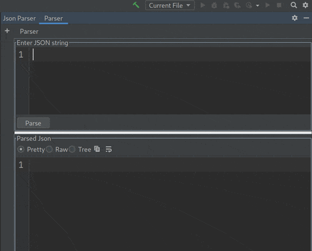

== https://plugins.jetbrains.com/plugin/164-ideavim[IdeaVim]

Pour avoir le même mode d'édition que Vim : les modes normal/insert/visual, les motion keys, etc.

== https://plugins.jetbrains.com/plugin/8320-uuid-generator[UUID Generator]

Générer un UUID, utile quand on écrit des tests.

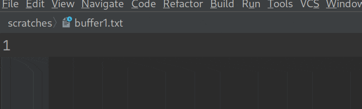

== https://plugins.jetbrains.com/plugin/12896-rainbow-csv[Rainbow CSV]

Ajouter de la couleur pour les fichiers CSV.

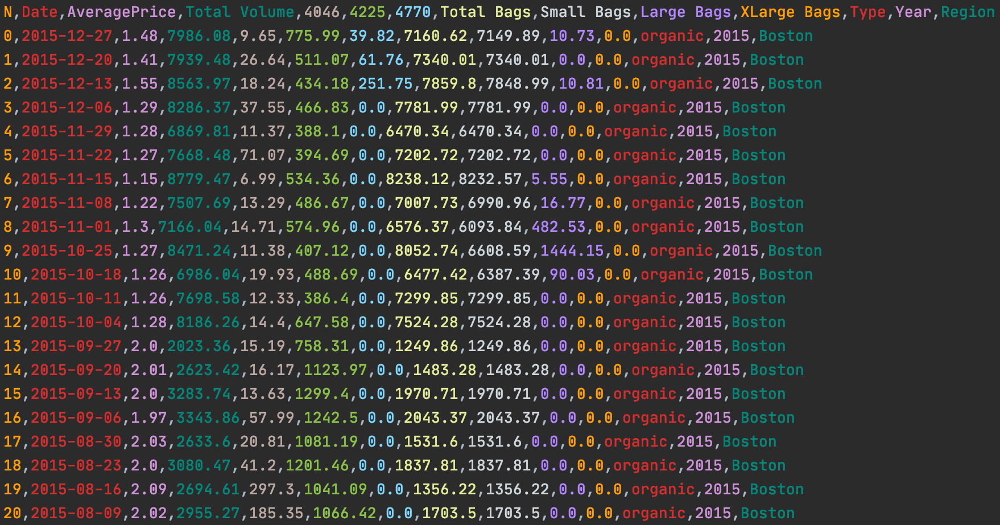

== https://plugins.jetbrains.com/plugin/7125-grep-console[Grep Console]

Mettre des couleurs custom dans les logs.

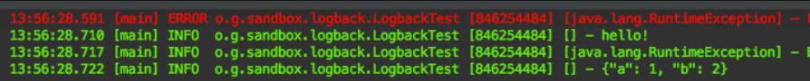

== https://plugins.jetbrains.com/plugin/10080-rainbow-brackets[Rainbow Brackets]

Accolades, parenthèses, etc. colorisées.

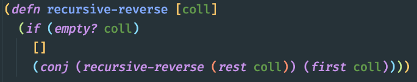

:sectnums:
